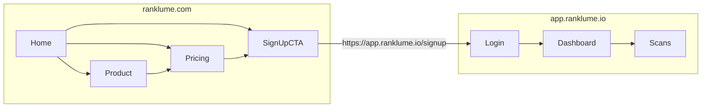
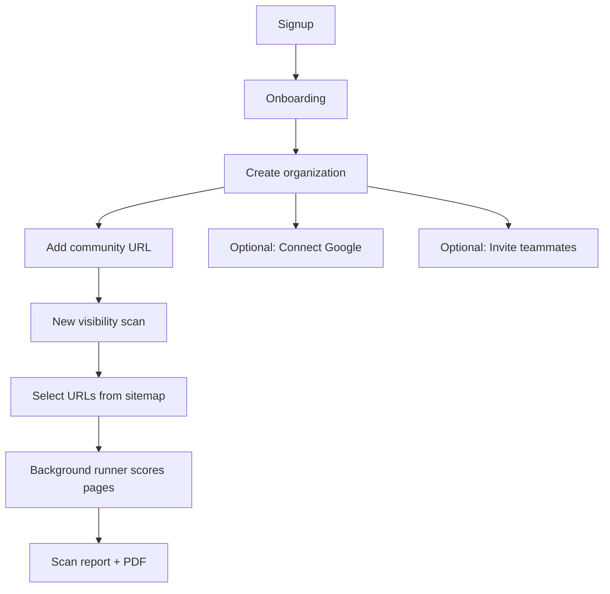

# Ranklume marketing site handoff

Handoff document for building the public marketing website at **https://ranklume.com**. The product application lives separately at **https://app.ranklume.io** (this repository). Use this file as the single source of product positioning, sitemap, page content specs, pricing facts, and app context for the other project team.

**Last synced from product repo:** geo-seo-audit-tool (Ranklume app).

---

## 1. Executive summary

### What Ranklume is

**Ranklume** is a B2B SaaS platform for **AI-powered SEO and GEO (Generative Engine Optimization) visibility audits** on **senior living community websites**. Operators and agencies run repeatable **visibility scans** across many sites, get scores and actionable fixes for both traditional search and AI surfaces (Google, AI overviews, assistants), track improvement over time, and export branded PDF reports.

### Who it is for

| Audience | Why they care |
|----------|----------------|
| **Senior living operators** | One or many communities; need consistent quality across property websites |
| **Regional / portfolio operators** | Scale audits across dozens of communities with org-level billing |
| **Marketing agencies & web partners** | Repeatable audits, team access, client-ready PDFs |
| **Executives & marketing leads** | Plain-language scores and trends, not only technical checklists |

**Secondary audience (indirect):** families comparing communities benefit from better sites, but the buyer and user are B2B teams.

### Core job-to-be-done

1. Organize work by **organization** (company/account) and **community** (one website URL each).
2. Run a **visibility scan**: discover URLs from sitemap, select pages, score each page (SEO + GEO).
3. Review pass/warn/fail checks, AI commentary, prioritized fixes, and optional Google Search Console / GA4 context.
4. Track **score history**, compare runs, export **PDF**, and optionally complete an **expert checklist** per community.

### Two web properties

| Property | URL | Role |
|----------|-----|------|
| **Marketing site** | `https://ranklume.com` | Product story, pricing, SEO, lead capture → signup on app |
| **Product app** | `https://app.ranklume.io` | Auth, dashboard, scans, billing, integrations |

The app deploy **must not** be indexed (`robots.ts` disallows all paths). Marketing SEO happens **only** on `ranklume.com`. The app root `/` redirects to `/login`; there is no marketing homepage on the app host.



---

## 2. Brand voice and messaging

### Voice

- **Clear and actionable** — pass/warn/fail checks, plain-language AI commentary, prioritized fixes (not dense jargon).
- **Senior-living aware** — trust, NAP/entity clarity, families and operators as readers.
- **Confident but honest** — explain what is automated vs optional (Google connect, PSI/CrUX when keys exist).

Derived from product AI voice (`lib/anthropic/system-prompt.ts`): advisor tone for multi-location and senior living sites; comments aimed at marketing, executives, or family decision-makers.

### Messaging pillars

| Pillar | Message |
|--------|---------|
| **Dual visibility** | Traditional **SEO** and **GEO** — visibility in Google **and** in AI assistants / overviews |
| **Senior living focus** | Built for operators and agencies serving senior living brands |
| **Actionable output** | Scores, checks, fixes, and editor-ready action items per page |
| **Portfolio scale** | Organizations → communities → scans; team invites; per-community billing |
| **Layered proof** | Deterministic HTML checks, PageSpeed Insights, Chrome UX Report, optional Google OAuth metrics, Claude GEO subscores |

### Terminology (use consistently)

| Term | Meaning |
|------|---------|
| **Visibility scan** | Primary product noun for an audit run (prefer over “audit” alone in marketing) |
| **Organization** | Account / company (e.g. operator or agency client) |
| **Community** | One senior living property website (one URL roster per community) |
| **Scores** | Overall, **SEO**, and **GEO** subscores (0–100) |
| **Tracked pages** | URLs on a community’s roster; **rescans of tracked pages are free** |
| **Scan start** | Starting a new visibility scan run (counts toward monthly allowance) |

### Tier display names (Stripe / app)

Internal slugs use `residence`, `community`, `portfolio`. **Customer-facing labels** on cards:

| Slug | Display name |
|------|----------------|
| `residence` | **Basic** |
| `community` | **Plus** |
| `portfolio` | **Pro** |

---

## 3. Primary CTAs

Use on every marketing page (header/footer):

| CTA | URL |
|-----|-----|
| **Get started** / **Start free** | `https://app.ranklume.io/signup` |
| **Log in** | `https://app.ranklume.io/login` |
| **Contact / Partner** | `https://ranklume.com/company/contact` (or mailto TBD) |

**TBD:** Sample PDF download, interactive demo, or “Book a demo” — not shipped in the app today; marketing can add when assets exist.

After signup, billing and checkout happen in the app at `https://app.ranklume.io/settings` (Billing tab).

---

## Part A — Marketing sitemap (`ranklume.com`)

### Global navigation

**Primary nav:** Product · Pricing · Resources · Company · [Log in] · [Get started]

**Footer:** Product links, Pricing, Resources, Company, Legal (Privacy, Terms, Security), Contact, social links TBD.

---

### Site map overview

```
ranklume.com/
├── /                          Home
├── /product
│   ├── /product/visibility-scans
│   ├── /product/seo-geo-scoring
│   ├── /product/google-integrations
│   ├── /product/reports-and-exports
│   └── /product/teams-and-organizations
├── /pricing
├── /pricing/compare             (optional; can be anchor on /pricing)
├── /resources
│   ├── /resources/blog
│   ├── /resources/guides/what-is-geo
│   └── /resources/guides/senior-living-seo
├── /company
│   ├── /company/about
│   └── /company/contact
├── /legal
│   ├── /legal/privacy
│   ├── /legal/terms
│   └── /legal/security
├── /sitemap.xml
├── /robots.txt
└── 404
```

**Not on marketing site:** All auth, dashboard, API, webhooks, and scan execution routes live on `app.ranklume.io` only.

---

### Page-by-page content specification

#### `/` — Home

**Goal:** Explain value in 10 seconds; drive signup.

**Sections:**

1. **Hero**
   - Headline options (see Copy bank).
   - Subhead: visibility scans for senior living websites — SEO + GEO scores, AI commentary, PDF reports.
   - Primary CTA → app signup; secondary → `/pricing`.

2. **Social proof** — TBD: operator logos, testimonial quotes, “communities scanned” stat.

3. **Three benefit cards**
   - **Scan at scale** — sitemap-driven URL selection, portfolio of communities.
   - **Clarity for every stakeholder** — pass/warn/fail + plain-language AI notes.
   - **Connect Google (optional)** — Search Console and GA4 context when mapped.

4. **How it works** (4 steps)
   - Create an organization → Add a community (website URL) → Run a visibility scan → Review scores, trends, and PDF.

5. **Feature grid** — Cards linking to `/product/*` subpages.

6. **Pricing teaser** — Basic / Plus / Pro per community; link to `/pricing`.

7. **Footer** — Nav, legal, CTAs.

**SEO:** Title/meta focused on “senior living SEO”, “GEO”, “visibility audit”.

---

#### `/product` — Product overview

**Goal:** Hub for capability depth; support consideration stage.

**Sections:**

1. **Problem** — Sites must rank in Google and be quotable/citable for AI; manual audits do not scale across communities.

2. **Solution** — Ranklume visibility scans: crawl → score → report → trend.

3. **Scan engine layers** (accurate to product)

   | Layer | What it measures | Notes for copy |
   |-------|------------------|----------------|
   | Deterministic (cheerio) | On-page SEO + GEO heuristics | No API key required |
   | PageSpeed Insights | Performance, accessibility, best practices | `PSI_API_KEY` |
   | Chrome UX Report | Field Core Web Vitals where available | `CRUX_API_KEY` or PSI fallback |
   | Anthropic Claude | GEO subscores + narrative + per-dimension actions | `ANTHROPIC_API_KEY` |
   | Site-wide probes | robots.txt, AI bot rules, sitemap discovery | On origin |
   | Google OAuth (optional) | GSC + GA4 field checks and traffic snapshots | Per organization |

4. **Flow diagram** — Sitemap probe → URL picker → background scoring → live progress → report + PDF.

5. **CTA** — Get started.

**Child pages:** Link cards to each `/product/...` page below.

---

#### `/product/visibility-scans` — Visibility scans

**Goal:** Explain the core workflow.

**Content:**

- **What is a visibility scan?** A scored run against selected pages for one community.
- **URL discovery** — Reads `robots.txt` and sitemaps; categories (Pages, Posts, etc.); per-URL checkboxes; cap configurable (default 100, up to 1000 per run with runtime warning above ~300).
- **Progress** — Live updates while scan runs; cancel in flight.
- **Resilience** — Queue/retries for failed runs (position as reliable background processing).
- **History** — Score trend chart per community; compare consecutive scans.
- **Screenshots** — TBD: new scan form, scan detail, progress bar.

**CTA:** Run your first scan → signup.

---

#### `/product/seo-geo-scoring` — SEO and GEO scoring

**Goal:** Explain checks and scores without overwhelming.

**SEO themes (deterministic + PSI where applicable):**

- Title and meta description
- H1 structure
- Image alt text
- HTTPS
- Schema / structured data
- Internal linking
- Mobile viewport
- PageSpeed / best practices

**GEO themes:**

- FAQ / Q&A-style content
- Entity clarity (name, location, services)
- Content depth and scannability
- Expertise / trust signals
- AI subscores: E-E-A-T-style dimensions (`eeat`, `content_depth`, `scannability`, `entity_clarity`) with **action items** per page

**How results are shown:**

- Each check: **pass / warn / fail** + explanation
- Per-page SEO and GEO scores (0–100)
- Community-level rollup and history

**CTA:** See it on your site → signup.

---

#### `/product/google-integrations` — Google Search Console and GA4

**Goal:** Position optional integration as high value, not required.

**Content:**

- Connect **once per organization** (OAuth).
- Map **Search Console site** and **GA4 property** per community.
- **Daily metrics sync** (cron) for traffic snapshots on community views.
- **Monthly digest email** (1st of month, ~07:00 UTC): refresh metrics, optional free visibility rescan, email digest (Resend). Recipients and toggles are configurable per organization under **Integrations → Google** (owners/admins/contact, extra addresses, disable rescans or metrics refresh).
- Disconnect anytime.
- **Not required** to run visibility scans.

**Trust:** Read-only Google scopes; tokens encrypted server-side (high-level; detail on `/legal/security`).

**CTA:** Connect after signup → `app.ranklume.io/integrations/google`.

---

#### `/product/reports-and-exports` — Reports and PDF

**Goal:** Sell deliverable output for agencies and executives.

**PDF includes (from product):**

- Summary scorecard (overall, SEO, GEO)
- Site-wide checks, CrUX, near-duplicate signals where present
- **Expert checklist appendix** (snapshot from community manual checklist)
- Per-page check results and fix lists
- Per-page manual notes when present

**Delivery:** Generated via React PDF; stored privately; download from scan detail.

**TBD:** Public sample PDF URL for marketing download.

**CTA:** Export your first report → signup.

---

#### `/product/teams-and-organizations` — Teams and multi-site

**Goal:** Speak to agencies and regional operators.

**Content:**

- **Organizations** — Billing and Google connection at org level.
- **Communities** — Many websites per org; per-community page roster and scan history.
- **Team invites** — Settings → Team; per-org invites; bulk invite across orgs; accept at `/invite/<token>`.
- **Roles** — Owners and admins (marketing: describe capabilities at high level; legal can refine).
- **Usage** — `/usage` in app shows meters vs plan.

**Pricing tie-in:** Per-community subscription; quantity = number of communities.

**CTA:** Invite your team → signup.

---

#### `/pricing` — Pricing

**Goal:** Transparent per-community pricing; drive checkout in app.

**Model (accurate):**

- Each tier is a **per-community subscription**.
- Customer picks tier (Basic / Plus / Pro) and **number of communities**.
- Stripe bills `unit_price × quantity` (quantity = community count).
- **Volume discounts** at 5 / 10 / 20 / 50+ communities: 5% / 10% / 15% / 20% off list subtotal (marketing should show calculator or table TBD).

**Public tiers (per community, USD)**

| Tier | Monthly | Yearly (≈17% off) | Tagline |
|------|---------|-------------------|---------|
| **Basic** | $29 | $290 | Perfect for single communities getting started with SEO and GEO |
| **Plus** | $59 | $590 | For regional operators managing several communities |
| **Pro** | $99 | $990 | For large operators and content-heavy multi-brand communities |

**Per-community limits (monthly billing slug; yearly matches)**

| Tier | Tracked pages / community | New pages added / month | Scan starts / month |
|------|---------------------------|-------------------------|-------------------|
| Basic | 50 | 20 | 10 |
| Plus | 150 | 60 | 20 |
| Pro | 500 | 200 | 40 |

**Included on all paid tiers (from product copy):**

- Full SEO + GEO visibility scans with AI commentary
- PDF export and scan history
- CrUX, PSI, and manual expert checklist support
- Rescans of **already-tracked** pages are always free
- **1 free auto rescan per month** (per product bullet)

**Add-ons (per community × pack quantity)**

| Add-on | What it adds | Price (per pack unit) |
|--------|--------------|------------------------|
| **Page pack** | +20 new pages/month on roster | $5/mo or $50/yr |
| **Run pack** | +10 scan starts/month | $10/mo or $100/yr |

Pack limits per community: Basic max 3 each type; Plus max 5; Pro and Partner unlimited.

**Partner program**

- For **more than 100 communities** or custom roster/scan needs.
- **Custom pricing — contact only** (no self-serve checkout by default).
- Copy: invoiced plans designed with you.

**Trial (if enabled in Stripe Checkout)**

- App may offer trialing subscription without card; trial caps: 1 community, 10 tracked pages, 10 new pages/month, 3 scan starts (reference only if trial is live).

**FAQ block** — See Copy bank; link to contact for Partner.

**CTA:** Choose plan → `https://app.ranklume.io/signup` then Settings → Billing.

---

#### `/pricing/compare` — Plan comparison (optional)

**Goal:** Side-by-side matrix.

Same data as `/pricing` in table form: limits, features, add-ons, volume discounts. Can be a section anchor on `/pricing` instead of a separate URL.

---

#### `/resources` — Resources hub

**Goal:** SEO content and nurture.

**Content:**

- Intro: guides and articles for senior living marketing and search teams.
- Cards to Blog, GEO guide, Senior living SEO guide.
- **TBD:** Glossary, webinars, case studies.

---

#### `/resources/blog` — Blog

**Goal:** Organic traffic and thought leadership.

**CMS:** TBD (headless CMS or markdown).

**Suggested categories:**

- SEO
- GEO / AI search
- Senior living marketing
- Product updates
- Case studies

**Template:** Title, author, date, category, body, CTA to product/signup.

---

#### `/resources/guides/what-is-geo` — Guide: What is GEO?

**Goal:** Educate on Generative Engine Optimization.

**Outline:**

1. Definition — optimizing content to be understood and cited by AI systems, not only ranked in classic SERPs.
2. Why senior living sites care — local intent, trust, structured answers.
3. How Ranklume measures GEO — checks + AI subscores (link to product page).
4. Practical steps — FAQ content, entity clarity, depth, schema.
5. CTA — Run a visibility scan.

---

#### `/resources/guides/senior-living-seo` — Guide: Senior living SEO

**Goal:** Top-of-funnel SEO aligned with product checks.

**Outline:**

1. Local and entity SEO basics (NAP, location pages).
2. Site structure and sitemaps.
3. Content depth for families and referrers.
4. Technical basics (HTTPS, titles, performance).
5. Measuring improvement over time (Ranklume trends).
6. CTA — Get started.

---

#### `/company/about` — About

**Goal:** Trust and mission.

**Content (TBD specifics):**

- Mission: help senior living operators improve discoverability in search and AI.
- Who we serve: operators, agencies, marketing teams.
- Team / story — placeholder.
- Link to contact and careers TBD.

---

#### `/company/contact` — Contact

**Goal:** Partner and enterprise leads.

**Content:**

- Contact form or email — TBD address (product uses `contact@ranklume.io` in docs for reports).
- **Partner program** inquiries (100+ communities).
- General support → app help or support email TBD.
- Office / hours TBD.

---

#### `/legal/privacy` — Privacy policy

**TBD:** Legal draft required. Must cover:

- Account data (Supabase Auth)
- Scan/crawl data (URLs, HTML excerpts, scores)
- Google OAuth tokens (encrypted)
- Stripe payment data
- Analytics on marketing site TBD
- Email (Resend) for transactional and monthly reports

---

#### `/legal/terms` — Terms of service

**TBD:** Legal draft required. Subscription terms, acceptable use, crawl scope (customer-owned sites), limitation of liability.

---

#### `/legal/security` — Security (recommended)

**Goal:** Reassure enterprise buyers.

**Points from product (high level):**

- Row Level Security (RLS) on tenant data in Supabase
- Service role used only on server for background jobs; never exposed to browser
- Outbound crawl SSRF protections on fetches
- Security headers (CSP, HSTS, etc.) on app
- Cron and runner endpoints require secrets (`CRON_SECRET`, `AUDIT_RUNNER_SECRET`)
- Stripe webhooks signature-verified
- Google tokens encrypted (`GOOGLE_TOKEN_ENCRYPTION_KEY`)
- Private PDF storage bucket
- **App host not indexed**; marketing host is public SEO surface

Detail reference: `docs/security.md` in product repo.

---

### Utility and SEO

| URL | Purpose |
|-----|---------|
| `/sitemap.xml` | All indexable marketing URLs |
| `/robots.txt` | Allow crawling of marketing site |
| **404** | Message + links: Home, Product, Pricing, Get started |

---

## Part B — Appendix: Product app (`app.ranklume.io`)

For **context only**. Do not duplicate these as marketing pages; link to the app for signup/login.

### App route map

| Area | Routes | User actions |
|------|--------|--------------|
| **Auth** | `/login`, `/signup`, `/forgot-password`, `/reset-password`, `/auth/callback` | Email/password (Supabase Auth) |
| **Root** | `/` | Redirects to `/login` |
| **Onboarding** | `/onboarding` | First-run setup |
| **Dashboard** | `/dashboard` | Org overview, getting-started checklist, recent scans |
| **Organizations** | `/companies`, `/companies/new`, `/companies/[id]`, `/companies/[id]/edit`, `/companies/[id]/new-community` | CRUD orgs and add communities |
| **Community** | `/communities/[id]`, `/communities/[id]/edit`, `/communities/[id]/traffic`, `/communities/[id]/new-visibility-scan` | History, traffic (Google), manual checklist, start scan |
| **Scan report** | `/visibility-scans/[id]` | Full report, PDF download, progress, cancel/retry |
| **Page detail** | `/visibility-scans/[id]/pages/[pageId]` | Per-page overview |
| **Page subviews** | `.../checks`, `.../fixes`, `.../social-preview`, `.../inspectors/schema`, `.../links`, `.../images`, `.../lighthouse` | Evidence and inspectors |
| **Integrations** | `/integrations/google` | OAuth connect; map GSC/GA4 per community |
| **Settings** | `/settings?tab=billing\|team\|organizations\|profile` | Stripe, invites, profile |
| **Usage** | `/usage` | Plan meters |
| **Invites** | `/invite/[token]` | Accept team invitation |

### API routes (not user-facing pages)

Background: `/api/visibility-scans/[id]/run`, `/api/visibility-scans/[id]/snapshot`, `/api/visibility-scans/cron-tick`, `/api/stripe/webhook`, `/api/integrations/google/*`, `/api/cron/monthly-google-report`, `/api/health`, etc.

### Key user flows



1. **Getting started checklist** (dashboard): add community → run scan → connect Google (optional) → invite teammate.
2. **Scan pipeline:** validate access → insert audit + job → kick runner → fetch HTML per URL → score (deterministic + PSI + CrUX + Claude) → update progress → complete → optional PDF.
3. **Three finding types:**
   - **Automated** — per-page SEO/GEO JSON + site-wide blobs on the scan.
   - **Expert checklist** — human sign-off on community page (`manual_check_results`); included in PDF appendix.
   - **Per-page notes** — free-form `manual_notes` on audit pages.

### Data model (simplified for copywriters)

- **Organization (company)** — has members, subscription, Google connection.
- **Community** — one `website_url`, scan history, page roster, optional GSC/GA4 mapping.
- **Visibility scan (audit)** — one run: status, scores, pages crawled, `target_urls`, PDF.
- **Audit page** — one URL’s results, fixes, notes.

### Integrations to mention on marketing site

| Integration | Role |
|-------------|------|
| **Anthropic Claude** | GEO commentary and subscores per page |
| **Google PageSpeed Insights** | Lab performance and related checks |
| **Chrome UX Report** | Field CWV where available |
| **Google Search Console & GA4** | OAuth; property mapping; metrics sync |
| **Stripe** | Subscriptions, Customer Portal, webhooks |
| **Supabase** | Auth, database, storage, realtime progress |
| **Resend** | Transactional / monthly report email |
| **Vercel** | Hosting (app + cron) |

### Environment / host facts

- Production app URL: `https://app.ranklume.io` (`NEXT_PUBLIC_SITE_URL`)
- Marketing URL: `https://ranklume.com` (separate repo/project)
- App `robots.txt`: disallow all

---

## Copy bank

### Hero headline options

1. **Visibility for senior living — in Google and in AI.**
2. **SEO and GEO visibility scans built for senior living communities.**
3. **Know how every community site performs — for search engines and AI.**

### Hero subhead (template)

Run repeatable visibility scans across your portfolio. Get SEO and GEO scores, plain-language AI insights, prioritized fixes, and branded PDF reports — with optional Google Search Console and Analytics.

### Tier taglines (use on pricing)

- **Basic:** Perfect for single communities getting started with SEO and GEO.
- **Plus:** For regional operators managing several communities.
- **Pro:** For large operators and content-heavy multi-brand communities.

### Partner program (short)

For organizations with more than 100 communities or custom roster, scan, and allowance needs. We design the plan with you and invoice off-platform. **Contact us** — not self-serve checkout.

### FAQ (marketing)

**What is GEO?**  
Generative Engine Optimization is the practice of making your content clear, trustworthy, and structured enough that AI systems (assistants, overviews, citations) can understand and reference your community accurately — not only ranking in traditional Google results.

**How is pricing calculated?**  
You choose a tier (Basic, Plus, or Pro) and the number of **communities** (websites) you manage. You pay per community per month or year. Volume discounts apply at 5, 10, 20, and 50+ communities.

**Does Ranklume replace our agency or SEO consultant?**  
No. Ranklume automates repeatable technical and content-surface audits at scale and produces evidence-backed reports. Many agencies use it to prioritize work across portfolios.

**Do we have to connect Google?**  
No. Visibility scans run without Google. Connecting Search Console and GA4 adds real traffic context and additional field checks.

**How long does a scan take?**  
Depends on how many pages you select. Small scans finish in a few minutes; large selections (hundreds of URLs) may approach background time limits — the product warns when selections are very large.

**What counts as a “scan start”?**  
Starting a new visibility scan run. Rescans of pages already on your tracked roster do not consume new-page allowance; product includes one free auto rescan per month on paid tiers.

**Is our data secure?**  
Tenant data is isolated with database row-level security. PDFs are private. Integration tokens are encrypted. See `/legal/security` on the marketing site.

---

## Assets and content TBD

| Item | Status |
|------|--------|
| Product screenshots / UI captures | TBD |
| Sample PDF report (public link) | TBD |
| Customer logos and testimonials | TBD |
| Privacy policy full text | TBD — legal |
| Terms of service full text | TBD — legal |
| Support email and contact routing | TBD |
| Blog CMS and initial posts | TBD |
| Favicon, OG images, brand guidelines | TBD |
| Demo video | TBD |

---

## Engineering source references (product repo)

Paths relative to `geo-seo-audit-tool/`:

| Topic | File |
|-------|------|
| Product overview | `README.md` |
| App vs marketing hosts | `docs/APP_HOST.md` |
| Security summary | `docs/security.md` |
| Pricing cards copy | `lib/billing/plans.ts` |
| Limits and USD prices | `lib/billing/plan-limits.ts` |
| AI voice and rubric | `lib/anthropic/system-prompt.ts` |
| Onboarding checklist | `lib/onboarding/setup-checklist.ts` |
| App routes | `app/**/page.tsx` |
| App robots (noindex) | `app/robots.ts` |

Do not copy secrets from `.env` into the marketing project.

---

## Changelog

| Date | Note |
|------|------|
| 2026-05-26 | Initial handoff document for ranklume.com build |
